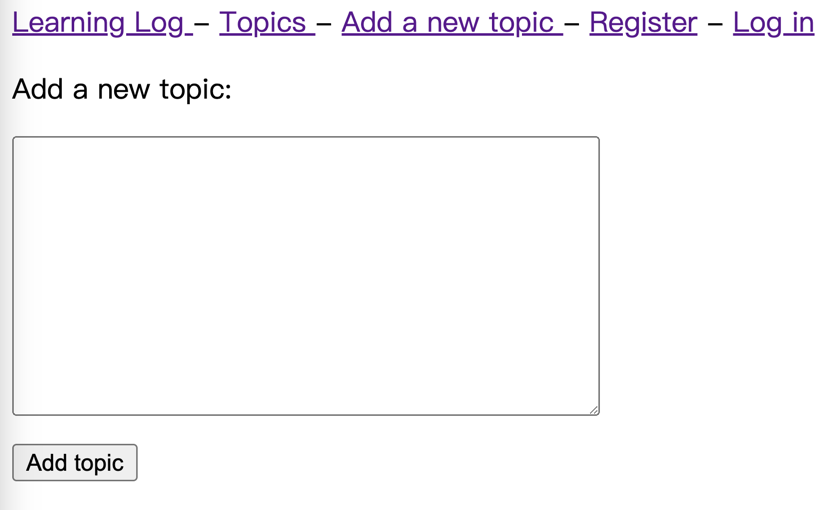
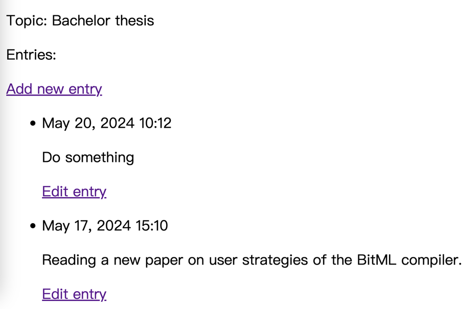
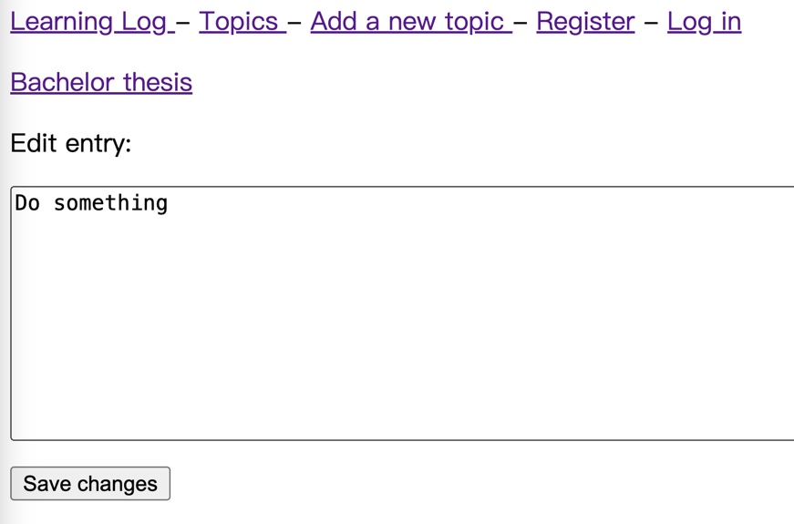
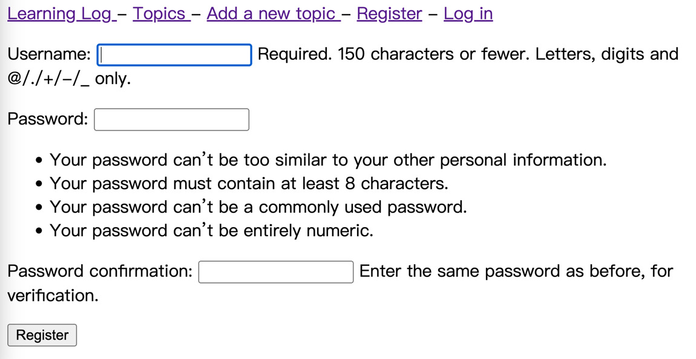
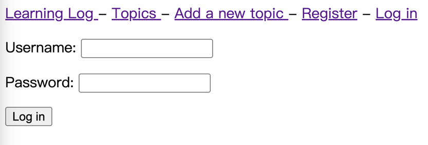
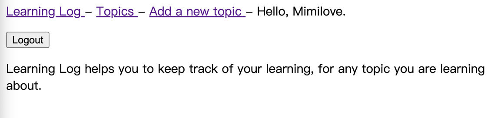
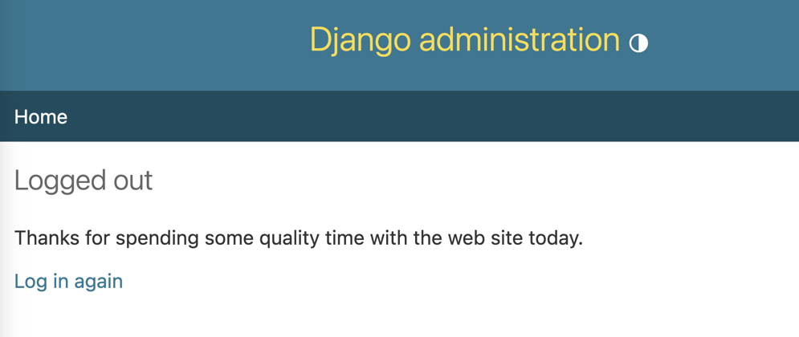

# learning_log
Learning Log helps you to keep track of your learning, for any topic you are learning about. 
It is a Django project of MVT structure. The project has two apps: logs and users. 

## 1. logs
To create new learning log topics and add new entries under the topics.
### 1.1 Add a topic

### 1.2 Add new entry under a topic

### 1.3 Edit existing entries

## 2. users
Users can log in and out. Also allowed to register new users.
### 2.1 Register new users

### 2.2 User login

### 2.3 After successfully logged in
User name will be shown on the page, and user can choose to log out.

### 2.4 User logged out
Using the django template for the logged out page. 

